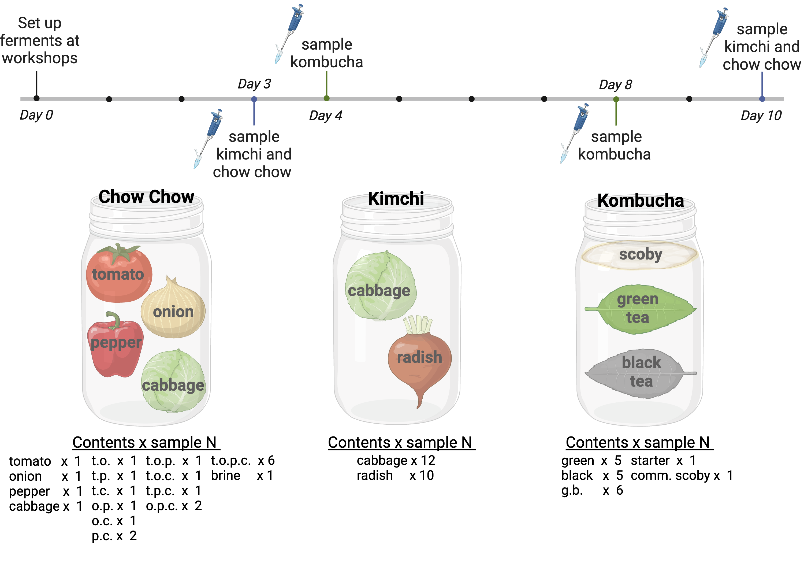

# Purpose
Use fermented foods Chow-chow, Kimchi, and Kombucha as model systems to understand microbial diversity. These foods can be created in a public science environment to engage the public and teach about food science and microbial ecology.

# Set up
Load packages and define ggplot theme settings
```{r, message=FALSE, warning=FALSE, echo=FALSE}
#load packages
library(tidyverse)
library(vegan)
library(rstatix)
library(indicspecies)
library(formattable)
library(kableExtra)
library(ggbeeswarm)
library(cowplot)
library(ggtext)
library(magick)

theme_set(theme_bw() +
          theme(axis.text = element_text(size=12),
                axis.title = element_text(size=15),
                strip.text = element_text(size=11),
                strip.background =element_rect(fill="white",color="white"),
                panel.grid.minor = element_blank()))

okabe_ito_colors <- list(scale_color_manual(values=c("#000000", "#56B4E9", "#009E73", "#D55E00",  "#CC79A7", "#E69F00", "#F0E442", "#0072B2")),
                         scale_fill_manual(values=c("#000000", "#56B4E9", "#009E73", "#D55E00",  "#CC79A7", "#E69F00", "#F0E442", "#0072B2")))

figure_out <- "./figures"
```
  
Create function to fix NAs at taxonomy levels
```{r, message=FALSE, warning=FALSE}
fixTaxaNAs <- function(df){
df_fixed <- df %>%
  mutate(Class=case_when(!is.na(Class)~paste0("c_", Class)),
         Order=case_when(!is.na(Order)~paste0("o_", Order)),
         Family=case_when(!is.na(Family)~paste0("f_", Family)),
         Species=case_when(!is.na(Genus)~replace_na(Species, "spp."))) %>%
  mutate(Class=coalesce(Class, Phylum),
         Order=coalesce(Order, Class),
         Family=coalesce(Family, Order),
         Genus=coalesce(Genus, Family)) %>%
  unite(Species2, c(Genus, Species), remove = FALSE, na.rm=TRUE, sep=" ")
return(df_fixed)  
}
```
  
Load data
```{r, message=FALSE, warning=FALSE, echo=FALSE}
# load data files
metadata_16S0 <- "./FF-16Smetatdata.txt" %>%
  read_tsv

ASV_16S0 <- "./16S_ASV_wTaxa.csv" %>%
  read_csv %>%
  select(ASVID, seq, Kingdom, Phylum, Class, Order, Family, Genus, Species, everything(), -"...1")

metadata_ITS0 <- "./FF-ITSmetatdata.txt" %>%
  read_tsv

ASV_ITS0 <- "./ITS_asv_wTaxa.txt" %>%
  read_tsv %>%
  select(c("#OTU.ID", "seq", "Kingdom", "Phylum", "Class", "Order", "Family", "Genus", "Species"), everything(), -"taxonomy") %>%
  dplyr::rename(ASVID=`#OTU.ID`)

#pH data
pH_df <- "fermented_foods_pH_data.csv" %>%
  read_csv

#new lactobacillus species
newLactoNames <- "./newLactoSpecNames.csv" %>%
  read_csv

naLactoSpecSeqs <- "./naLactoSpecSeqs.csv" %>%
  read_csv
```

  Create shortcuts for substrates
```{r, message=FALSE, warning=FALSE, echo=FALSE}
# plant lists
chowPlants <- c("Tomato", "Onion", "Pepper", "Cabbage", "brine") %>%
  set_names(., nm=.)

kimchiPlants <- c("Cabbage", "Radish") %>%
  set_names(., nm=.)

teaPlants <- c("green", "black", "starter", "scoby") %>%
  set_names(., nm=.)
```
  
Organize metadata
```{r, message=FALSE, warning=FALSE, echo=FALSE}
#organizing metadata
metadata_16S <- metadata_16S0 %>%
  dplyr::rename(SampleID=`#SampleID`) %>%
  add_column(!!!map(c(chowPlants, teaPlants,  "Radish"="Radish", "Dandelion"="Dandelion"), ~str_detect(metadata_16S0$Plant, .x))) %>% # add TRUE/FALSE columns for each plant/ingredient
  mutate(nPlants = rowSums(across(where(is.logical))), # add count of plants in each sample
         DayN = case_when(Day=="three"~3,
                          Day=="four"~4,
                          Day=="eight"~8,
                          Day=="ten"~10), # create numerical column for days
         JarID=case_when(str_detect(FoodID, "d|D[0-9]+")~str_extract(FoodID, ".*(?=d|D[0-9]+)"), # make sample name column without day designation to test samples between days
                          !str_detect(FoodID, "d|D[0-9]+")~FoodID),
         ControlSample=case_when(str_detect(Plant, "brine|scoby|starter")~Plant,
                                 !str_detect(Plant, "brine|scoby|starter")~"sample"),
         Primers="Bacteria") %>%
  filter(Experiment!="Lab", # remove samples not relevant to this study
         Experiment!="control",
         !(str_detect(SampleID, "Laura")))
```

```{r, message=FALSE, warning=FALSE, echo=FALSE}
# organize metadata
metadata_ITS <- metadata_ITS0 %>%  
dplyr::rename(SampleID=`#SampleID`) %>%
  add_column(!!!map(teaPlants, ~str_detect(metadata_ITS0$Plant, .x))) %>% # add TRUE/FALSE columns for each plant/ingredient
  mutate(nPlants = rowSums(across(where(is.logical))), # add count of plants in each sample
         DayN = case_when(Day=="three"~3,
                          Day=="four"~4,
                          Day=="eight"~8,
                          Day=="ten"~10), # create numerical column for days
         JarID=case_when(str_detect(FoodID, "d|D[0-9]+")~str_extract(FoodID, ".*(?=d|D[0-9]+)"), # make sample name column without day designation to test samples between days
                          !str_detect(FoodID, "d|D[0-9]+")~FoodID),
         ControlSample=case_when(str_detect(Plant, "brine|scoby|starter")~Plant,
                                 !str_detect(Plant, "brine|scoby|starter")~"sample"),
         Experiment="Tea (Fungi)", # change name of experiment for ability to unite tables later
         Primers="Fungi") %>%
   filter(!(str_detect(SampleID, "Laura")))
```

# Experiment Overview
  Figure 2


# Samples and Experimental Design
   Clean up recipe labels
```{r}
chowRecipes <- c("Tomato", "Onion", "Pepper", "Cabbage", "TomatoOnion", "TomatoPepper", "TomatoCabbage", "OnionPepper",  "OnionCabbage", "PepperCabbage", "TomatoOnionPepper", "TomatoOnionCabbage", "TomatoPepperCabbage", "OnionPepperCabbage", "TomatoOnionPepperCabbage", "brine")
chowRecipeLabels <- c("tomato", "onion", "pepper", "cabbage", "tomato & onion", "tomato & pepper", "tomato & cabbage", "onion & pepper",  "onion & cabbage", "pepper & cabbage", "tomato, onion & pepper", "tomato, onion & cabbage", "tomato, pepper & cabbage", "onion, pepper & cabbage", "tomato, onion, pepper & cabbage", "brine")

kimchiRecipes <- c("Cabbage", "Radish")
kimchiRecipeLabels <- c("cabbage", "radish")


teaRecipes <- c("green", "black", "greenblack", "starter", "scoby")
teaRecipeLabels <- c("green tea", "black tea", "green & black teas", "starter", "commercial scoby")
```
  
  Samples, per experiment, per day
```{r, message=FALSE, warning=FALSE, echo=FALSE}
metadata_16S %>%
  filter(!is.na(DayN)) %>%
  count(Experiment, DayN) %>%
  select(-Experiment) %>%
  kable(col.names = c("Day", "N samples")) %>%
  row_spec(0, bold=TRUE) %>%
  kable_classic(html_font = "Arial", full_width=FALSE) %>%
  pack_rows("Chow chow", 1, 2, bold = TRUE) %>%
  pack_rows("Kimchi", 3, 4, bold = TRUE) %>%
  pack_rows("Kombucha", 5, 6, bold = TRUE)
```
## Table S1: List of all samples:
  Levels per experiment
```{r, message=FALSE, echo=FALSE}
metadata_16S %>%
  with_groups(Experiment, summarize, ncats=n_distinct(Plant)) %>%
  .$ncats
```

```{r}
sampleNtable <- metadata_16S %>%
  filter(Experiment!="Lab", Experiment!="control") %>%
  with_groups(c(Experiment, Plant), summarize, N=n_distinct(JarID)) %>%
  mutate(Plant=factor(Plant, levels=c(chowRecipes, "Radish", teaRecipes), labels = c(chowRecipeLabels, "radish", teaRecipeLabels))) %>%
  arrange(Experiment, Plant) %>%
  select(-Experiment) %>%
  kableExtra::kable(caption = "Table S1. Sample contents", col.names = c("Contents", "N samples")) %>%
  row_spec(0, bold=TRUE) %>%
  kable_classic(html_font = "Arial", full_width=FALSE) %>%
  pack_rows("Chow chow", 1, 16, bold = TRUE) %>%
  pack_rows("Kimchi", 17, 18, bold = TRUE) %>%
  pack_rows("Kombucha", 19, 23, bold = TRUE) 
sampleNtable
save_kable(sampleNtable, zoom=5, file = file.path(figure_out, paste0("TableS1_", Sys.Date(), "_sampleNs.png")))
```
  * Note, kombucha tea and starter samples (not scoby) also sequenced with ITS primers

# Sequencing Descriptives
## Reassign lactobacilli for emended genus 
```{r}
ASV_16S1 <- ASV_16S0 %>%
  left_join(newLactoNames) %>%
  replace_na(list(newGenus="x", newSpecies="x")) %>% 
  mutate(Genus=case_when(newGenus!="x"~newGenus, # update to new genus name
                         newGenus=="x"~Genus),
         Species=case_when(newGenus!="x"~newSpecies, # update to new species names
                           newGenus=="x"~Species)) %>%
  select(-newGenus, -newSpecies) %>% # remove those columns
  left_join(naLactoSpecSeqs) %>% # update genus names for lactobacilli that were not assigned at the species level
  mutate(Genus=case_when(Genus=="Lactobacillus"&is.na(Species)~newGenus,
                         Genus=="Lactobacillus"&!is.na(Species)~Genus,
                         Genus!="Lactobacillus"~Genus)) %>%
  select(-newGenus)
```

## Filter and clean 16S
```{r}
nrow(ASV_16S1)
```

There are a total of `r nrow(ASV_16S0)` 16S ASVs before filtering.  
  Remove the following:  
  
* Eukaryotes
* Chloroplasts
* Mitochondria  
```{r, message=FALSE, warning=FALSE, echo=FALSE}
ASV_16S <- ASV_16S1 %>%
  filter(Kingdom!="Eukaryota", # remove eukaryotes
         Order!="Chloroplast", # remove chloroplasts
         Family!="Mitochondria", # remove mitochondria
         !is.na(Phylum)) # remove anything unassigned at the phylum level
```
  
`r nrow(ASV_16S)` ASVs remain after filtering.

  Filter dataframes to samples in chow-chow, kimchi, and tea experiments only. 
```{r, message=FALSE, warning=FALSE, echo=FALSE}
ASV_16S_expts0 <- ASV_16S %>%
  select(ASVID, seq, Kingdom, Phylum, Class, Order, Family, Genus, Species, one_of(metadata_16S$SampleID))
```

```{r}
#ASVs that appear in each experiment
experiment_16SASVs_df <-ASV_16S_expts0 %>%
  gather("SampleID", "Abundance", one_of(metadata_16S$SampleID)) %>%
  left_join(metadata_16S, by = "SampleID") %>%
  filter(Abundance>0) %>%
  select(Experiment, seq) %>%
  unique

experiment_16SASVs_list <- experiment_16SASVs_df %>%
  split(.$Experiment) %>%
  map(~.x$seq)

ASV_16S_expts <- ASV_16S_expts0 %>%
  gather("SampleID", "Reads", one_of(metadata_16S$SampleID)) %>%
  left_join(select(metadata_16S, "Experiment", "SampleID"), by = "SampleID") %>%
  right_join(experiment_16SASVs_df, by = c("seq", "Experiment")) # remove ASVs from each experiment that do not appear in respective samples
```
  
## Filter and clean ITS
```{r, message=FALSE, warning=FALSE,}
ASV_ITS <- ASV_ITS0 %>%
  select(ASVID, seq, Kingdom, Phylum, Class, Order, Family, Genus, Species, one_of(metadata_ITS$SampleID))
```
  
There are `r nrow(ASV_ITS)` ITS ASVs. 

```{r, message=FALSE, warning=FALSE, echo=FALSE}
ASV_ITS %>%
  select(Phylum, Class, Order, Family, Genus, Species, ASVID) %>%
  unique %>%
  select(-ASVID) %>%
  replace_na(list(Class="", Order="", Family="", Genus="", Species="")) %>%
  arrange(Phylum, Class, Order, Genus, Family="", Species) %>%
  kable() %>%
  row_spec(0, bold=TRUE) %>%
  kable_classic(html_font = "Arial", full_width=FALSE)
```
  
  All ASVs are assigned at the phylum level, and the phyla Ascomycota	and Basidiomycota are represented.
  Most ASVs are Saccharomycetes. No filtering needed

## Join tables
```{r, message=FALSE, warning=FALSE}
ASV_df <- ASV_ITS %>%
  gather("SampleID", "Reads", one_of(metadata_ITS$SampleID)) %>%
  mutate(Experiment="Tea (Fungi)") %>%
  full_join(ASV_16S_expts)
  
metadata_df <- metadata_16S %>%
  full_join(metadata_ITS)
```

## Library sizes 
```{r, message=FALSE, warning=FALSE, echo=FALSE}
libSizes <- ASV_df %>%
  with_groups("SampleID", summarize, LibrarySize=sum(Reads))

libSizePlot <- libSizes %>%
  left_join(metadata_df, by="SampleID") %>%
  filter(Experiment != "Lab", Experiment != "control") %>%
  mutate(Experiment=factor(Experiment, levels=c("Chow", "Kimchi", "Tea", "Tea (Fungi)"), labels=c("Chow chow", "Kimchi", "Kombucha", "Kombucha (fungi)")),
         ControlSample=factor(ControlSample, levels = c("sample", "brine", "starter", "scoby"), labels = c("sample", "brine", "starter", "commercial scoby"))) %>%
  ggplot(aes(x=Experiment, y=(LibrarySize/1000))) +
  geom_boxplot(alpha=0, color="gray") +
  geom_quasirandom(aes(color=ControlSample)) +
  facet_wrap(~Primers, scales = "free_x") +
  scale_color_manual(values=c("#000000", "#56B4E9", "#D55E00", "#009E73")) +
  scale_y_continuous(n.breaks = 10) +
  labs(x="Experiment", y="Library size (Thousands)", color="Sample type")+
  theme(panel.grid.minor = element_blank(),
        panel.grid.major.x = element_blank())

```

  The ranges of library sizes varies by experiment, rarefying should be performed separately for alpha diversity analyses.
  
  The minimum library sizes for rarefying are:
```{r, message=FALSE, warning=FALSE, echo=FALSE}
minimumLibSize <- libSizes %>%
  left_join(metadata_df, by="SampleID") %>%
  filter(!(Experiment %in% c("Lab", "control"))) %>%
  with_groups(Experiment, summarize, `Minimum library size`=prettyNum(min(LibrarySize), big.mark = ",")) %>%
  mutate(Experiment=factor(Experiment, levels=c("Chow", "Kimchi", "Tea", "Tea (Fungi)"), labels=c("Chow chow", "Kimchi", "Kombucha", "Kombucha (fungi)")))

minLibSizeTable <- minimumLibSize %>%
  kable() %>%
  row_spec(0, bold=TRUE) %>%
  kable_classic(html_font = "Arial", full_width=FALSE)

save_kable(minLibSizeTable, file.path(figure_out, "minLibSizeTable.png"), zoom=11)
```
  Figure S1: Library Sizes
```{r}
bottom_row <- plot_grid(ggdraw() + draw_image(file.path(figure_out, "minLibSizeTable.png")), ggplot() + theme_void(),  ncol = 2,  labels = c("B", ""), label_size = 15)

plot_grid(libSizePlot, bottom_row, ncol = 1, rel_widths = 1, rel_heights = c(1,0.3), labels = c("A", "B"), label_size = 15)
#ggsave(filename = file.path(figure_out, paste0(Sys.Date(), "FigureS1_library_sizes.png")))
```

# Species accumulation curves and rarefaction curves
## Species accumulation curves
```{r, message=FALSE, warning=FALSE, echo=FALSE}
#samples as rows and ASVs as columns
asvMatrices <- ASV_df %>%
  mutate(Experiment=factor(Experiment, levels=c("Chow", "Kimchi", "Tea", "Tea (Fungi)"), labels=c("Chow chow", "Kimchi", "Kombucha", "Kombucha (fungi)"))) %>%
  split(.$Experiment) %>%
  map(~spread(.x, "SampleID", "Reads")) %>%
  map(~column_to_rownames(.x, "ASVID")) %>%
  map(~select_if(.x, is.numeric)) %>%
  map(t)

FMR <- map(asvMatrices, ~specaccum(.x, "random"))
map2(FMR, names(FMR), ~plot(.x, ci.type="poly", col="blue",  lwd=2, ci.lty=0, ci.col="lightblue", main=paste0("Taxa accumulation curve: ", .y)))
```

## Rarefaction curve

```{r, message=FALSE, warning=FALSE}
raremax <- map(asvMatrices, ~min(rowSums(.x))) 

vegan::rarecurve(asvMatrices$`Chow chow`, step = 20, sample = raremax$`Chow chow`, ylab = "ASVs", col = "blue", cex = 0.6, xlim=c(0,4000))
title(main="Chow Chow")

vegan::rarecurve(asvMatrices$Kimchi, step = 20, sample = raremax$Kimchi, ylab = "ASVs", label = FALSE, col = "blue", cex = 0.6, xlim=c(0,4000))
title(main="Kimchi")

vegan::rarecurve(asvMatrices$Kombucha, step = 20, sample = raremax$Kombucha, ylab = "ASVs", col = "blue", cex = 0.6, xlim=c(0,4000))
title(main="Kombucha")

vegan::rarecurve(asvMatrices$`Kombucha (fungi)`, step = 20, sample = raremax$`Kombucha (fungi)`, ylab = "ASVs", col = "blue", cex = 0.6, xlim=c(0,4000))
title(main="Kombucha (fungi)")
```

## ASVs before rarefying  
```{r, message=FALSE, warning=FALSE}
S <- map(asvMatrices, specnumber) # observed number of ASVs per sample
S %>%
  map(~as_tibble(.x, rownames = "SampleID")) %>%
  purrr::reduce(full_join) %>%
  left_join(metadata_df) %>%
  mutate(Experiment=factor(Experiment, levels=c("Chow", "Kimchi", "Tea", "Tea (Fungi)"), labels=c("Chow chow", "Kimchi", "Kombucha", "Kombucha (fungi)")),
         ControlSample=factor(ControlSample, levels=c("sample", "brine", "starter", "scoby"), labels = c("sample", "brine", "starter", "commercial scoby"))) %>%
  ggplot(aes(x=Experiment, y=value, color=ControlSample)) +
  geom_boxplot(alpha=0, color="gray") +
  geom_quasirandom(alpha=0.7, size=2, width=0.3) +
  scale_color_manual(values=c("#000000", "#56B4E9", "#D55E00", "#009E73")) +
  facet_wrap(~Primers, scales="free") +
  labs(x=NULL, y="N unique ASVs", color="Sample type")+
  theme(panel.grid.minor = element_blank(),
        panel.grid.major.x = element_blank())
  
```

# Analyses
## Data prep
### Alpha Diversity
  Rarefy to common read depth for each experiment
```{r, message=FALSE, warning=FALSE}
rarefied_asv_df <- map2(asvMatrices, raremax, rrarefy) %>%
  map(~as_tibble(.x, rownames = "SampleID")) %>%
  map(~gather(.x, "ASVID", "rarefiedReads", 2:ncol(.x))) %>%
  purrr::reduce(full_join) %>%
  left_join(ASV_df)  %>%
  left_join(metadata_df)
```

  Rarefied richness vs. observed richness
```{r, message=FALSE, warning=FALSE}
rarefied_asv_df %>%
  group_by(Experiment, SampleID) %>%
  summarize_at(vars("Reads", "rarefiedReads"), ~sum(.x>0)) %>%
  mutate(Experiment=factor(Experiment, levels=c("Chow", "Kimchi", "Tea", "Tea (Fungi)"), labels=c("Chow chow", "Kimchi", "Kombucha", "Kombucha (fungi)"))) %>%
  ggplot(aes(x=Reads, y=rarefiedReads)) +
  geom_abline(yintercept=0, slope = 1, color="gray", linetype=2) +
  geom_point(shape=1) +
  facet_wrap(~Experiment, scales="free") +
  theme(aspect.ratio = 1) +
  labs(x="Observed no. of ASVs", y="Rarefied no. of ASVs")
```
  Rarefying doesn't impact richness much. Largest impact is in kimchi samples

### Beta Diversity
  Do not rarefy ([McMurdie & Holmes, 2014](https://journals.plos.org/ploscompbiol/article?id=10.1371/journal.pcbi.1003531))
  Normalize by calculating relative abundance
  Make ASV counts proportions

```{r, message=FALSE, warning=FALSE}
ASV_df_prop <- ASV_df %>%
  with_groups(SampleID, mutate, Abundance=Reads/sum(Reads))
```

### Descriptives
  ASVs per experiment:
```{r, message=FALSE, warning=FALSE, echo=FALSE}
ASV_df %>%
  mutate(Experiment=factor(Experiment, levels=c("Chow", "Kimchi", "Tea", "Tea (Fungi)"), labels=c("Chow chow", "Kimchi", "Kombucha", "Kombucha (fungi)"))) %>%
  filter(Reads>0) %>%
  select(seq, Genus, Species, SampleID, Experiment, Reads) %>%
  with_groups(Experiment, summarize, `No. unique genera`=n_distinct(Genus), `No. unique ASVs`=n_distinct(seq)) %>%
  kable() %>%
  row_spec(0, bold=TRUE) %>%
  kable_classic(html_font = "Arial", full_width=FALSE)
```
  Table of top taxa
```{r, message=FALSE, warning=FALSE}
ASV_df_prop %>%
  group_by(Experiment, ASVID, Family, Genus, Species) %>%
  summarize(`Mean abundance`=mean(Abundance)) %>%
  replace_na(list(Genus="", Species="")) %>%
  group_by(Experiment) %>%
  top_n(4, `Mean abundance`) %>%
  mutate(`Mean abundance`=round(`Mean abundance`, 2)) %>%
  arrange(Experiment, -`Mean abundance`) %>%
  ungroup %>%
  select(Family, Genus, Species, `Mean abundance`) %>%
  kableExtra::kable() %>%
  row_spec(0, bold=TRUE) %>%
  kable_classic(html_font = "Arial", full_width=FALSE) %>%
  pack_rows("Chow chow", 1, 4, bold = TRUE) %>%
  pack_rows("Kimchi", 5, 8, bold = TRUE) %>%
  pack_rows("Kombucha", 9, 12, bold = TRUE) %>%
  pack_rows("Kombucha (fungi)", 13, 16, bold = TRUE)
```
  Stacked bar plot
```{r, message=FALSE, warning=FALSE, fig.height=6, fig.width=13}

# get top Species and percents of species not in top 
top_species <- ASV_df_prop %>%
  fixTaxaNAs() %>%
  with_groups(c(SampleID, Experiment, Species2), summarize, Abundance=sum(Abundance)) %>%
  with_groups(c(Experiment, Species2), summarize, `Mean abundance`=mean(Abundance)) %>%
  group_by(Experiment) %>%
  top_n(9, `Mean abundance`) %>%
  select(Experiment, Species2) %>%
  filter(Species2!="p__Ascomycota")

ASV_df_prop %>%
  fixTaxaNAs() %>%
  with_groups(c(Experiment, Species2, SampleID), summarize, Abundance=sum(Abundance)) %>%
  right_join(top_species) %>%
  with_groups(c(Experiment, SampleID), summarize, x=sum(Abundance)) %>%
  with_groups(Experiment, summarize, `Percent of reads`=mean(x))

other <- ASV_df_prop %>%
  fixTaxaNAs() %>%
  right_join(top_species) %>%
  group_by(SampleID) %>%
  mutate(Abundance=1-sum(Abundance)) %>%
  select(SampleID, Experiment, Abundance) %>%
  unique %>%
  mutate(Species2="Other")
```

```{r, message=FALSE, warning=FALSE}
# make factors for ordering samples
chowJars <- c( "brine", "T", "O", "P", "C", "TO", "TP", "TC", "OP1", "OC", "PC1", "PC2", "TOP", "TOC", "TPC", "OPC1",  "OPC2",  "TOPC1", "TOPC2", "TOPC3", "TOPC4", "TOPC5", "TOPC6")
kimchiJars <- c("KC1", "KC2", "KC3", "KC4", "KC5",  "KC6",  "KC7",  "KC8",  "KC9",  "KC10", "KC11", "KC12", "KR1",  "KR2",  "KR3",  "KR4",  "KR5",  "KR6",  "KR7",  "KR8",  "KR9", "KR10")
teaJars <- c("G2", "G3", "G4", "G5", "G6", "B2", "B3", "B4", "B5", "B6", "GB2", "GB3", "GB4", "GB5", "GB6", "GB7", "starter", "SCOBYPeak")
```

### Figure 3: Microbial communities with species absolute abundance
```{r, message=FALSE, warning=FALSE, fig.height=6, fig.width=13}
chowColors <- c("gray40","#CC79A7", "#0072B2",  "#D55E00",  "#56B4E9", "#009E73",  "#E69F00", "darkslateblue", "#F0E442",  "darkgreen")
kimchiColors <- c("gray40", "#CC79A7", "darkblue", "khaki1", "mediumpurple4", "#009E73", "darkred", "lightskyblue3", "darkgreen", "salmon1")
kombuchaColors <- c("gray40", "#CC79A7", "indianred", "darkgoldenrod", "darkcyan", "darkblue","#0072B2", "mediumpurple4", "lightgoldenrod", "darkred")
kombuchaFungiColors <- c("gray40", "forestgreen", "chocolate3", "mediumorchid3", "blue3", "burlywood", "olivedrab4", "lightsteelblue")

barPlotColors <- list(chowColors,
                   kimchiColors, 
                   kombuchaColors,
                   kombuchaFungiColors)

bar_plots <- ASV_df_prop %>%
  select(-Reads) %>%
  fixTaxaNAs() %>%
  right_join(top_species) %>%
  full_join(other) %>%
  left_join(metadata_df) %>%
  with_groups(Experiment, mutate, DayO=dense_rank(DayN)) %>%
  mutate(DayO=factor(DayO, levels=c(1, 2), labels=c("First", "Second")),
        JarID=factor(JarID, levels=c(chowJars, kimchiJars, teaJars)),
        Experiment=factor(Experiment, levels=c("Chow", "Kimchi", "Tea", "Tea (Fungi)"), labels=c("Chow chow", "Kimchi", "Kombucha", "Kombucha (fungi)"))) %>%
  replace_na(list(DayO="First")) %>%
  split(.$Experiment) %>%
  map(~mutate(.x, Species2=factor(Species2, levels = c("Other", sort(unique(grep("_|Other", Species2, value = TRUE, invert = TRUE))), sort(unique(grep("_", Species2, value = TRUE))))))) %>%
  map(~mutate(.x, Species3=case_when(str_detect(Species2, "_|Other")~Species2, 
                                     !str_detect(Species2, "_|Other|spp")~paste0("*", Species2, "*"),
                                     Species=="spp."~paste(paste0("*", Genus, "*"), Species)))) %>%
  map(~mutate(.x, Species3=factor(Species3, levels = c("Other", sort(unique(grep("_|Other", Species3, value = TRUE, invert = TRUE))), sort(unique(grep("_", Species3, value = TRUE))))))) %>%
  map2(., barPlotColors, ~ggplot(.x, aes(x=JarID, y=Abundance, fill=Species2)) +
        geom_bar(stat="identity") +
        facet_grid(DayO~Experiment, scales = "free_x") +
        scale_fill_manual(values=.y, labels=levels(.$Species3)) +
        theme(axis.text.x = element_text(angle=45, hjust=1, size=6),
        axis.text.y = element_blank(),
        legend.position = "bottom",
        legend.direction = "vertical",
        legend.text = element_markdown(),
        strip.text.y = element_blank()) +
        labs(x=NULL, y=NULL, fill="Species"))

plot_grid(bar_plots$`Chow chow` + theme(axis.text.y = element_text()) + labs(y="Relative abundance"),
          bar_plots$Kimchi,
          bar_plots$Kombucha,
          bar_plots$`Kombucha (fungi)` + theme(strip.text.y = element_text()),
          nrow=1,
          rel_widths = c(length(chowJars), length(kimchiJars), length(teaJars), length(teaJars)-1),
          align = "h",
          axis = "bt")
#ggsave(filename = file.path(figure_out, paste0(Sys.Date(), "_Figure3_abundance_bar_plot.png")))
```

  
  *Komagataeibacter* proportion of fungi in kombucha samples
```{r, message=FALSE, warning=FALSE}
ASV_df_prop %>%
  filter(Genus=="Komagataeibacter",
         Experiment=="Tea") %>%
  left_join(metadata_df[,c("SampleID", "Day")]) %>%
  with_groups(c(SampleID, Day), summarize, Abundance=sum(Abundance)) %>%
  summarize(mean(Abundance))
```
  
  *Dekkera bruxellensis* proportion of fungi in kombucha samples
```{r, message=FALSE, warning=FALSE}
ASV_df_prop %>%
  filter(Genus=="Dekkera", 
         Species=="bruxellensis",
         Experiment=="Tea (Fungi)") %>%
  left_join(metadata_df[,c("SampleID", "Day")]) %>%
  with_groups(c(SampleID, Day), summarize, Abundance=sum(Abundance)) %>%
  with_groups(Day, summarize, mean(Abundance))
```


## Does diversity increase with the number of plants?
### Alpha Diversity
 Does alpha diversity increase as the number of plants in the recipes increases?  
   + Compare the samples from day 10 only for chow chow and day 8 for kombucha. Cannot use both days in the same statistical test because they are from the same sample. 
   + Does alpha diversity increase as the number of plants increases from 1 to 4? Test with Kruskall-Wallace for chow chow and Wilcoxon ranked sum for kombucha.

```{r, message=FALSE, warning=FALSE}
diversity_df <- rarefied_asv_df %>%
  filter(!is.na(DayN)) %>%
  select(SampleID, Experiment, ASVID, rarefiedReads) %>%
  nest(ASVmatrix=c("SampleID", "ASVID", "rarefiedReads")) %>%
  mutate(ASVmatrix=map(ASVmatrix, ~spread(.x, ASVID, rarefiedReads)), #make a column of ASV matrices for vegan calculations
         ASVmatrix=map(ASVmatrix, ~column_to_rownames(.x, var="SampleID")),
         ASVmatrix=map(ASVmatrix, as.matrix)) %>%
 mutate(richness=map(ASVmatrix, vegan::specnumber),
        richness=map(richness, ~as_tibble(.x, rownames = "SampleID")),
        shannon=map(ASVmatrix, ~vegan::diversity(.x, "shannon")),
        shannon=map(shannon, ~as_tibble(.x, rownames = "SampleID"))) %>%
  select(Experiment, richness, shannon) %>%
  unnest(cols = c(richness, shannon), names_sep= "_") %>%
  select(-shannon_SampleID) %>%
  dplyr::rename(SampleID=richness_SampleID) %>%
  left_join(metadata_df, by=c("Experiment", "SampleID"))
```

  Perform statistical tests
```{r, message=FALSE, warning=FALSE}
# Kruskall wallace for chow chow
diversity_df %>%
  filter(Experiment=="Chow", 
         DayN==10, # use second day only
         ControlSample=="sample") %>% 
  mutate(nPlants=as.character(nPlants)) %>%
  gather("measure", "value", c(richness_value, shannon_value)) %>%
  group_by(measure, Experiment) %>%
  kruskal_test(value~nPlants)
# not significant

# wilcox for tea
diversity_df %>%
  filter(Experiment %in% c("Tea", "Tea (Fungi)"), 
         DayN==8, # use second day only
         ControlSample=="sample") %>% 
  mutate(nPlants=as.character(nPlants)) %>%
  gather("measure", "value", c(richness_value, shannon_value)) %>%
  group_by(measure, Experiment) %>%
  wilcox_test(value~nPlants)
# no significant differences
```

### Figure 4: Impacts of substrate number on alpha diversity
```{r, message=FALSE, warning=FALSE}
richness_nPlant_plot <- diversity_df %>%
  filter(Experiment %in% c("Chow", "Tea", "Tea (Fungi)"), 
         DayN %in% c(8, 10),
         ControlSample=="sample") %>%
  mutate(Experiment=factor(Experiment, levels=c("Chow", "Tea", "Tea (Fungi)"), labels=c("Chow chow", "Kombucha", "Kombucha (fungi)")),
         nPlants=as.character(nPlants)) %>%
  ggplot(aes(x=nPlants, y=richness_value, group=nPlants)) +
  geom_boxplot(alpha=0) +
  geom_point(alpha=0.5) +
  facet_wrap(~Experiment, scales = "free") +
  labs(x=NULL, y="Richness")+
  scale_y_continuous(limits = c(0, NA)) +
  theme(axis.text.x = element_blank(),
        panel.grid.minor = element_blank(),
        panel.grid.major.x = element_blank())

shannon_nPlant_plot <- diversity_df %>%
  filter(Experiment %in% c("Chow", "Tea", "Tea (Fungi)"), 
         DayN %in% c(8, 10),
         ControlSample=="sample") %>%
  mutate(Experiment=factor(Experiment, levels=c("Chow", "Tea", "Tea (Fungi)"), labels=c("Chow chow", "Kombucha", "Kombucha (fungi)")),
         nPlants=as.character(nPlants)) %>%
  ggplot(aes(x=nPlants, y=shannon_value, group=nPlants)) +
  geom_boxplot(alpha=0) +
  geom_point(alpha=0.5) +
  scale_y_continuous(limits = c(0, NA)) + 
  facet_wrap(~Experiment, scales = "free") +
  theme(strip.text.x = element_blank()) +
  labs(x="No. of plant substrates", y="Shannon index")+
  theme(panel.grid.minor = element_blank(),
        panel.grid.major.x = element_blank())

plot_grid(richness_nPlant_plot, shannon_nPlant_plot, nrow=2)
#ggsave(filename = file.path(figure_out, paste0(Sys.Date(), "Figure4_alpha_vs_nsubstrates.png")))
```

## Does the substrate impact diversity?
### Alpha diversity
  Perform statistical tests
```{r, message=FALSE, warning=FALSE}
# Kruskall wallace for Tea
alpha_by_substrate_tea <- diversity_df %>%
  filter(Experiment %in% c("Tea", "Tea (Fungi)"), 
         DayN==8,
         ControlSample=="sample") %>%
  mutate(Plant=factor(Plant, levels=c("green", "black", "greenblack"), 
                            labels=c("Green", "Black", "Green & Black"))) %>%
  gather("measure", "value", c(richness_value, shannon_value)) %>%
  group_by(measure, Experiment) %>%
  kruskal_test(value~Plant)
alpha_by_substrate_tea
# not significant

# wilcox for kimchi
alpha_by_substrate_kimchi <- diversity_df %>%
  filter(Experiment=="Kimchi", 
         DayN==10,
         ControlSample=="sample") %>%
  mutate(Plant=factor(Plant, levels=c("Cabbage", "Radish"), 
                             labels=c("Cabbage", "Radish"))) %>%
  gather("measure", "value", c(richness_value, shannon_value)) %>%
  group_by(measure, Experiment) %>%
  wilcox_test(value~Plant, alternative="two.sided") %>%
  adjust_pvalue(p.col="p", method = "BH")
alpha_by_substrate_kimchi
# Both significant
```

  Plot
```{r, message=FALSE, warning=FALSE}
richness_Plant_plot <- diversity_df %>%
  filter(Experiment %in% c("Kimchi", "Tea", "Tea (Fungi)"), DayN %in% c(8, 10), ControlSample=="sample") %>%
  mutate(Experiment=factor(Experiment, levels=c("Chow", "Kimchi", "Tea", "Tea (Fungi)"), labels=c("Chow chow", "Kimchi", "Kombucha", "Kombucha (fungi)")),
         Plant=factor(Plant, levels=c("Cabbage", "Radish", "green", "black", "greenblack"), labels=c("Cabbage", "Radish", "Green", "Black", "Green & Black")),
         plabel=case_when(Experiment=="Kimchi"~"*",
                          Experiment!="Kimchi"~NA)) %>%
  with_groups(Experiment, mutate, py=max(richness_value)) %>%
  ggplot(aes(x=Plant, y=richness_value, group=Plant, label=plabel)) +
  geom_boxplot(alpha=0) +
  geom_point(alpha=0.5) +
  geom_text(aes(x=1.5, y=py-2), size=5) +
  facet_wrap(~Experiment, scales = "free") +
  scale_y_continuous(limits = c(0, NA)) +
  theme(axis.text.x = element_blank(),
        panel.grid.minor = element_blank(),
        panel.grid.major.x = element_blank()) +
  labs(x=NULL, y="Richness")

shannon_Plant_plot <- diversity_df %>%
  filter(Experiment %in% c("Kimchi", "Tea", "Tea (Fungi)"), DayN %in% c(8, 10), ControlSample=="sample") %>%
  mutate(Experiment=factor(Experiment, levels=c("Chow", "Kimchi", "Tea", "Tea (Fungi)"), labels=c("Chow chow", "Kimchi", "Kombucha", "Kombucha (fungi)")),
         Plant=factor(Plant, levels=c("Cabbage", "Radish", "green", "black", "greenblack"), labels=c("Cabbage", "Radish", "Green", "Black", "Green\n&\nBlack")),
         plabel=case_when(Experiment=="Kimchi"~"*",
                          Experiment!="Kimchi"~NA)) %>%
  with_groups(Experiment, mutate, py=max(shannon_value)) %>%
  ggplot(aes(x=Plant, y=shannon_value, group=Plant, label=plabel)) +
  geom_boxplot(alpha=0) +
  geom_point(alpha=0.5) +
  geom_text(aes(x=1.5, y=py-0.3), size=5) +
  facet_wrap(~Experiment, scales = "free") +
  scale_y_continuous(limits = c(0, NA)) +
  theme(strip.text.x = element_blank(),
        panel.grid.minor = element_blank(),
        panel.grid.major.x = element_blank()) +
  labs(x="Substrate", y="Shannon index")
                      
substrate_alpha_plot <- plot_grid(richness_Plant_plot, shannon_Plant_plot, nrow=2, rel_heights = c(1, 1.27))
```

### Beta diversity
  Calculate Bray-Curtis distances and visualize with NMDS
  Substrates (second day only)
```{r, message=FALSE, warning=FALSE, fig.width=12, fig.height=3}
set.seed(123)

nmds <- ASV_df_prop %>%
  left_join(metadata_df) %>%
  filter(Experiment %in% c("Kimchi", "Tea", "Tea (Fungi)"),
         ControlSample=="sample",
         DayN %in% c(8, 10)) %>%
  select(SampleID, Experiment, ASVID, Abundance) %>%
  split(.$Experiment) %>%
  map(~select(.x, -Experiment)) %>%
  map(~spread(.x, ASVID, Abundance)) %>%
  map(~column_to_rownames(.x, var = "SampleID")) %>%
  map(as.matrix) %>%
  map(~metaMDS(.x, distance = "bray"))

data.scores <- nmds %>%
  map(~scores(.x)$sites) %>%
  map(as.data.frame) %>%
  map(~rownames_to_column(.x, var="SampleID")) %>%
  map2(., names(.), ~mutate(.x, Experiment=.y)) %>%
  purrr::reduce(full_join) %>%
  left_join(metadata_df) %>%
  mutate(Plant=factor(Plant, levels=c("Cabbage", "Radish", "green", "black", "greenblack"), labels=c("Cabbage", "Radish", "Green", "Black", "Green & Black")))

plantNMDSKimchi <- data.scores %>%
  filter(Experiment=="Kimchi") %>%
  ggplot(aes(x=NMDS1, y=NMDS2, color=Plant)) +
  geom_point() +
  facet_wrap(~Experiment, scales = "free") +
  scale_color_manual(values=c("#0072B2", "#D55E00")) +
  theme(legend.position = "none") +
  labs(x=NULL, y=NULL)

kimchiLegend <- get_legend(
  plantNMDSKimchi +
  theme(legend.position = "bottom",
        legend.direction = "vertical",
        legend.justification = c(0,1)) +
  labs(color="Kimchi substrates"))

plantNMDSTea3 <- data.scores %>%
  filter(Experiment=="Tea") %>%
  mutate(Experiment="Kombucha: all conditions") %>%
  ggplot(aes(x=NMDS1, y=NMDS2, color=Plant)) +
  geom_point() +
  facet_wrap(~Experiment, scales = "free") +
  scale_color_manual(values=c("#009E73","#000000", "#CC79A7")) +
  theme(legend.position = "none") +
  labs(y=NULL, x=NULL)
  
teaLegend <- get_legend(
  plantNMDSTea3 +
  #guides(color=guide_legend(ncol = 2)) +
  theme(legend.position = "bottom",
        legend.direction = "vertical",
        legend.justification = c(0,1)) +
  labs(color="Kombucha substrates"))


plantNMDSTeaITS <- data.scores %>%
  filter(Experiment=="Tea (Fungi)") %>%
  mutate(Experiment="Kombucha (fungi)") %>%
  ggplot(aes(x=NMDS1, y=NMDS2, color=Plant)) +
  geom_point() +
  facet_wrap(~Experiment, scales = "free") +
  scale_color_manual(values=c("#009E73","#000000", "#CC79A7")) +
  theme(legend.position = "none",
        axis.text.x = element_text(size=10)) +
  labs(y=NULL, x=NULL)

#tea with only green or black samples only
nmds <- ASV_df_prop %>%
  left_join(metadata_df) %>%
  filter(Experiment %in% c("Tea", "Tea (Fungi)"),
         ControlSample=="sample",
         DayN==8,
         Plant %in% c("green", "black")) %>%
  select(SampleID, Experiment, ASVID, Abundance) %>%
  split(.$Experiment) %>%
  map(~select(.x, -Experiment)) %>%
  map(~spread(.x, ASVID, Abundance)) %>%
  map(~column_to_rownames(.x, var = "SampleID")) %>%
  map(as.matrix) %>%
  map(~metaMDS(.x, distance = "bray"))

data.scores <- nmds %>%
  map(~scores(.x)$sites) %>%
  map(as.data.frame) %>%
  map(~rownames_to_column(.x, var="SampleID")) %>%
  map2(., names(.), ~mutate(.x, Experiment=.y)) %>%
  purrr::reduce(full_join) %>%
  left_join(metadata_df) %>%
  mutate(Plant=factor(Plant, levels=c("green", "black"), labels=c("Green", "Black")))

plantNMDSTea2 <- data.scores %>%
  filter(Experiment=="Tea") %>%
  mutate(Experiment="Kombucha: green OR black") %>%
  ggplot(aes(x=NMDS1, y=NMDS2, color=Plant)) +
  geom_point() +
  facet_wrap(~Experiment, scales = "free") +
  scale_color_manual(values=c("#009E73","#000000")) +
  theme(legend.position = "none",
        strip.text.x = element_text(size=9)) +
  labs(x=NULL, y=NULL)

plantNMDSTeaITS2 <- data.scores %>%
  filter(Experiment=="Tea (Fungi)") %>%
  mutate(Experiment="Kombucha (f): green OR black") %>%
  ggplot(aes(x=NMDS1, y=NMDS2, color=Plant)) +
  geom_point() +
  facet_wrap(~Experiment, scales = "free") +
  scale_color_manual(values=c("#009E73","#000000")) +
  theme(legend.position = "none",
        axis.text.x = element_text(size=10),
        strip.text.x = element_text(size=8)) +
  labs(x=NULL, y=NULL)
```
  plot
```{r, message=FALSE, warning=FALSE}
legends <- plot_grid(kimchiLegend, teaLegend, theme_void(), ncol=1, rel_heights = c(1, 1, 0.5))
row1 <- plot_grid(plantNMDSKimchi, plantNMDSTea3, plantNMDSTea2, nrow=1)
row2 <- plot_grid(plantNMDSTeaITS, plantNMDSTeaITS2, legends, nrow=1, rel_widths = c(1, 1, 0.7))
row12 <- plot_grid(row1, add_sub(row2, "NMDS1"), ncol=1, rel_heights = c(1, 1.1))
substrate_beta_plot <- plot_grid(add_sub(plot_grid(ggplot+theme_void()+theme(panel.grid.minor = element_blank()), row12, nrow=1, rel_widths = c(0.05,1)), "NMDS2",  angle=90, x=0.05, y=3.9))
```

 PERMANOVA
```{r, message=FALSE, warning=FALSE}
#tea grean, black, and green and black
bray_by_plant_data  <- metadata_df %>%
  filter(Experiment %in% c("Tea", "Tea (Fungi)"),
         ControlSample=="sample",
         DayN %in% c(8, 10)) %>%
  column_to_rownames(var="SampleID") %>%
  split(.$Experiment)

bray_by_plant_asvs <- ASV_df_prop %>%
  left_join(metadata_df) %>%
  filter(Experiment %in% c("Tea", "Tea (Fungi)"),
         ControlSample=="sample",
         DayN %in% c(8, 10)) %>%
  select(Experiment, SampleID, ASVID, Abundance) %>%
  split(.$Experiment) %>%
  map(~spread(.x, ASVID, Abundance)) %>%
  map(~select(.x, -Experiment)) %>%
  map(~column_to_rownames(.x, var="SampleID"))

set.seed(021324)
map2(bray_by_plant_data, bray_by_plant_asvs, ~adonis2(formula=.y~nPlants+Plant, data=.x, permutations=999, method="bray"))
```
  Number of plants not significant, so it was removed.
```{r}
set.seed(021324)
map2(bray_by_plant_data, bray_by_plant_asvs, ~adonis2(formula=.y~Plant, data=.x, permutations=999, method="bray"))
```

```{r, message=FALSE, warning=FALSE}
#kimchi and 2 teas
bray_by_plant_data  <- metadata_df %>%
  filter(Experiment %in% c("Kimchi", "Tea", "Tea (Fungi)"),
         ControlSample=="sample",
         DayN %in% c(8, 10),
         Plant!="greenblack") %>%
  column_to_rownames(var="SampleID") %>%
  split(.$Experiment)

bray_by_plant_asvs <- ASV_df_prop %>%
  left_join(metadata_df) %>%
  filter(Experiment %in% c("Kimchi", "Tea", "Tea (Fungi)"),
         ControlSample=="sample",
         DayN %in% c(8, 10),
         Plant!="greenblack") %>%
  select(Experiment, SampleID, ASVID, Abundance) %>%
  split(.$Experiment) %>%
  map(~spread(.x, ASVID, Abundance)) %>%
  map(~select(.x, -Experiment)) %>%
  map(~column_to_rownames(.x, var="SampleID"))

set.seed(021324)
map2(bray_by_plant_data, bray_by_plant_asvs, ~adonis2(formula=.y~Plant, data=.x, permutations=999, method="bray"))
```

### Figure 5: Impacts of substrate type on diversity
```{r, message=FALSE, warning=FALSE, fig.width=7.5, fig.height=10}
plot_grid(substrate_alpha_plot, substrate_beta_plot, nrow = 2, rel_heights = c(0.8, 1), labels = c("A", "B"))
#ggsave(filename = file.path(figure_out, paste(Sys.Date(), "Figure5_substrate_figure.png", sep = "_")))
```

## Succession over time
###  pH over time
  statistical tests
```{r, message=FALSE, warning=FALSE}
#Chow chow and tea 
#kruskall wallis
pHkruskalls <- pH_df %>%
  filter(Experiment=="Chow"|Experiment=="Tea",
         ControlSample=="sample") %>%
  with_groups(JarID, mutate, DayO=dense_rank(Day)) %>%
  group_by(Experiment) %>%
  kruskal_test(pH~DayO)
pHkruskalls

#dunns posthoc
pH_df %>%
  filter(Experiment=="Chow"|Experiment=="Tea",
         ControlSample=="sample") %>%
  with_groups(JarID, mutate, DayO=dense_rank(Day)) %>%
  group_by(Experiment) %>%
  dunn_test(pH~DayO, p.adjust.method = "BH")

#kimchi 
kimchipHinput <- pH_df %>%
  filter(Experiment=="Kimchi",
         ControlSample=="sample") %>%
  with_groups(JarID, mutate, DayO=dense_rank(Day)) %>%
  select(JarID, pH, DayO) %>%
  spread(DayO, pH)
kimchipHwilcox <- wilcox.test(kimchipHinput$`1`, kimchipHinput$`2`,  paired = TRUE, alternative = "greater")
kimchipHwilcox
kimchipHwilcox$p.value
```

```{r, message=FALSE, warning=FALSE}
pH_pvalues <- tribble(~Experiment, ~p.value,
                      "Chow chow", pHkruskalls$p[pHkruskalls$Experiment=="Chow"],
                      "Kimchi", kimchipHwilcox$p.value,
                      "Kombucha", pHkruskalls$p[pHkruskalls$Experiment=="Tea"]) %>%
  mutate(p.value=formatC(p.value, format = "e", digits = 2))

pH_pgroups <- tribble(~Experiment, ~Day, ~label,
                      "Chow chow", 0, "a",
                      "Chow chow", 3, "b",
                      "Chow chow", 10, "b",
                      "Kimchi", 3, "a",
                      "Kimchi", 10, "b",
                      "Kombucha", 0, "a",
                      "Kombucha", 4, "b",
                      "Kombucha", 8, "c",
                      "Kombucha", 21, "d")
```

  Plot
```{r, message=FALSE, warning=FALSE, fig.height=3, fig.width=6}
pH_day_plot <- pH_df %>%
  add_row(Experiment="Kimchi", pH=NULL, Day=0, ControlSample="sample") %>% # add fake row to make chow chow and kimchi x-axis scales the same
  mutate(Experiment=factor(Experiment, levels=c("Chow", "Kimchi", "Tea", "Tea (Fungi)"), labels=c("Chow chow", "Kimchi", "Kombucha", "Kombucha (fungi)")),
           ControlSample=factor(ControlSample, levels=c("sample", "brine", "starter"))) %>%
  ggplot(aes(x=Day, y=pH)) +
  geom_line(aes(group=JarID), color="gray") +
  geom_point(aes(color=ControlSample), alpha=0.6) +
  geom_text(data=pH_pgroups, aes(x=Day, y=7.6, label=label)) +
  geom_text(data = pH_pvalues, aes(x=0, y=0.25, label=paste("p = ", p.value)), hjust="left") +
  okabe_ito_colors +
  scale_x_continuous(n.breaks = 6) +
  scale_y_continuous(breaks = c(0, 2, 4, 6, 8), labels = c(0, 2, 4, 6, 8), limits = c(0,8)) +
  facet_wrap(~Experiment, nrow=1, scales="free_x") +
  theme(axis.text = element_text(size=11), 
        legend.title = element_text(size=15), 
        legend.text = element_text(size=13),
        panel.grid.minor = element_blank()) +
  labs(x="Day", y="pH", color="Sample type")
  
pH_day_plot
```

### Alpha Diversity
  Does alpha diversity increase as the number of days elapsed increases?  
   + Test with Wilcoxon Rank-Sum test, comparing raw richness and Shannon index between 3 and 10 days (4 and 8 for tea experiment)
   
  Run paired wilcoxon test
```{r, message=FALSE, warning=FALSE}
diversity_df %>%
  with_groups(JarID, filter, n_distinct(SampleID)=="2"|n_distinct(SampleID)==4) %>% # remove samples that don't have two timepoint measurements
  with_groups(Experiment, mutate, DayO=dense_rank(DayN)) %>%
  mutate(DayO=factor(DayO, levels=c(1, 2), labels=c("First", "Second"))) %>%
  select(JarID, Experiment, DayO, richness_value, shannon_value) %>%
  gather("measure", "value", c(richness_value, shannon_value)) %>%
  spread(DayO, value) %>%
  split(list(.$measure, .$Experiment)) %>%
  map(~wilcox.test(.x$Second, .x$First,  paired = TRUE, alternative = "greater")) %>%
  map(tidy) %>%
  map2(., names(.), ~mutate(.x, x=.y)) %>%
  purrr::reduce(full_join) %>%
  separate(x, into=c("measure", "Experiment"), sep="\\.") %>%
  select(measure, Experiment, statistic, p.value) %>%
  arrange(measure) %>%
  group_by(Experiment) %>%
  adjust_pvalue(p.col="p.value", method = "BH")
```


```{r, message=FALSE, warning=FALSE}
richness_day_plot <- diversity_df %>%
  with_groups(JarID, filter, n_distinct(SampleID)=="2"|n_distinct(SampleID)==4) %>% # remove samples that don't have two timepoint measurements
  mutate(Experiment=factor(Experiment, levels=c("Chow", "Kimchi", "Tea", "Tea (Fungi)"), labels=c("Chow chow", "Kimchi", "Kombucha", "Kombucha (fungi)")),
         DayN=as.character(DayN),
         DayN=factor(DayN, levels=c("3", "4", "8","10"))) %>%
  ggplot(aes(x=DayN, y=richness_value)) +
  geom_line(aes(group=JarID), color="gray") +
  geom_point(alpha=0.5) +
  scale_x_discrete(drop=TRUE) +
  facet_wrap(~Experiment, scales = "free", nrow=1) +
  scale_y_continuous(limits = c(0, NA)) +
  theme(axis.text.x = element_blank(),
        axis.text = element_text(size=11),
        panel.grid.minor = element_blank(),
        panel.grid.major = element_blank()) +
  labs(x=NULL, y="Richness")

shannon_day_plot <- diversity_df %>%
  with_groups(JarID, filter, n_distinct(SampleID)=="2"|n_distinct(SampleID)==4) %>% # remove samples that don't have two timepoint measurements
  mutate(Experiment=factor(Experiment, levels=c("Chow", "Kimchi", "Tea", "Tea (Fungi)"), labels=c("Chow chow", "Kimchi", "Kombucha", "Kombucha (fungi)")),
         DayN=as.character(DayN),
         DayN=factor(DayN, levels=c("3", "4", "8","10"))) %>%
  ggplot(aes(x=DayN, y=shannon_value)) +
  geom_line(aes(group=JarID), color="gray") +
  geom_point(alpha=0.5) +
  scale_x_discrete(drop=TRUE) +
  facet_wrap(~Experiment, scales = "free", nrow = 1) +
  scale_y_continuous(limits = c(0, NA)) +
  theme(strip.text.x = element_blank(),
        axis.text = element_text(size=11),
        panel.grid.minor = element_blank(),
        panel.grid.major = element_blank()) +
  labs(x="Day", y="Shannon index")

succession_alpha_plot <- plot_grid(richness_day_plot, shannon_day_plot, nrow=2, align = "v", axis="lr")
succession_alpha_plot
```

### Beta diversity
  plot
```{r, message=FALSE, warning=FALSE, fig.width=7, fig.height=5}
set.seed(123)

nmds <- ASV_df_prop %>%
  select(SampleID, Experiment, ASVID, Abundance) %>%
  split(.$Experiment) %>%
  map(~select(.x, -Experiment)) %>%
  map(~spread(.x, ASVID, Abundance)) %>%
  map(~column_to_rownames(.x, var = "SampleID")) %>%
  map(as.matrix) %>%
  map(~metaMDS(.x, distance = "bray"))

data.scores <- nmds %>%
  map(~scores(.x)$sites) %>%
  map(as.data.frame) %>%
  map(~rownames_to_column(.x, var="SampleID")) %>%
  map2(., names(.), ~mutate(.x, Experiment=.y)) %>%
  purrr::reduce(full_join) %>%
  left_join(metadata_df) %>%
  mutate(DayN=as.character(DayN)) %>%
  replace_na(list(DayN="NA")) %>%
    mutate(Experiment=factor(Experiment, levels=c("Chow", "Kimchi", "Tea", "Tea (Fungi)"), labels=c("Chow chow", "Kimchi", "Kombucha", "Kombucha (fungi)")),
         DayN=factor(DayN, levels=c("NA", "3", "4", "8", "10")),
         ControlSample=factor(ControlSample, levels=c("sample", "brine", "starter", "scoby"), labels=c("sample", "brine", "starter", "commercial scoby")))

succession_beta_plot <- data.scores %>%
  ggplot(aes(x=NMDS1, y=NMDS2, color=DayN, shape=ControlSample)) +
  geom_point() +
  facet_wrap(~Experiment, scales = "free") +
  okabe_ito_colors +
  theme(axis.text = element_text(size=11), 
        legend.title = element_text(size=15), 
        legend.text = element_text(size=13),
        panel.grid.minor = element_blank()) +
  labs(color="Day", shape="Sample type")
succession_beta_plot
```

```{r, message=FALSE, warning=FALSE}
bray_by_day_data  <- metadata_df %>%
  filter(ControlSample=="sample") %>%
  column_to_rownames(var="SampleID") %>%
  split(.$Experiment)

bray_by_day_asvs <- ASV_df_prop %>%
  left_join(metadata_df) %>%
  filter(ControlSample=="sample") %>%
  select(Experiment, SampleID, ASVID, Abundance) %>%
  split(.$Experiment) %>%
  map(~spread(.x, ASVID, Abundance)) %>%
  map(~select(.x, -Experiment)) %>%
  map(~column_to_rownames(.x, var="SampleID"))

set.seed(021324)
map2(bray_by_day_data, bray_by_day_asvs, ~adonis2(formula=.y~Day, data=.x, permutations=999, method="bray"))
```

### Figure S3: Succession over time
```{r, message=FALSE, warning=FALSE, fig.height=10, fig.width=8}
plot_grid(pH_day_plot, succession_alpha_plot, succession_beta_plot, ncol=1, labels = c("A", "B", "C"), rel_heights = c(1, 1.4, 1.9))
#ggsave(filename = file.path(figure_out, paste(Sys.Date(), "FigureS3_succession_figure.png", sep="_")))
```

## Indicator Taxa Analysis
  
* Measure indicator correlation indices of ASVs for variables with significant impact on bacterial community based on PERMANOVA results
* Test ASVs that are present in ≥ 10% samples per experiment
* Use the indicspecies package for this analysis ([De Caceres et al., 2023](https://CRAN.R-project.org/package=indicspecies))

```{r, message=FALSE, warning=FALSE}
#10% of samples
sample10 <- metadata_df %>%
  count(Experiment) %>%
  mutate(n10=n/10)
sample10
```

### Day
```{r, message=FALSE, warning=FALSE}
#significant differences in communities by day in Kimchi and Chow chow samples
indvday0 <- ASV_df_prop %>%
  with_groups(c(Experiment, ASVID), filter, sum(Abundance>0)>=4) %>% # in 10% of samples
  with_groups(c(Experiment, ASVID), filter, mean(Abundance)>=0.001) %>% #average abundance of 0.1%
  left_join(metadata_df[,c("SampleID", "Day", "ControlSample")]) %>%
  filter(ControlSample=="sample", Experiment %in% c("Chow", "Kimchi")) %>%
  select(SampleID, Experiment, Day, ASVID, Abundance) %>%
  split(.$Experiment) %>%
  map(~spread(.x, ASVID, Abundance))

indvday_asv <- indvday0 %>%
  map(~select(.x, -Day,  -Experiment)) %>%
  map(~column_to_rownames(.x, var="SampleID"))

indvday_groups <- indvday0 %>%
  map(~.x$Day)

set.seed(0123)    
indval_day <- map2(indvday_asv, indvday_groups, ~multipatt(.x, .y, control = how(nperm=999))) 

indval_day_tables <- list(indval_day$Chow$sign, indval_day$Kimchi$sign) %>%
  map2(., c("Chow", "Kimchi"), ~mutate(.x, Experiment=.y)) %>%
  map(~rownames_to_column(.x, var="ASVID")) %>%
  map(~adjust_pvalue(data=.x, p.col="p.value", method = "fdr")) %>%
  map(~left_join(.x, unique(ASV_df_prop[,c("ASVID", "Phylum", "Class", "Order", "Family", "Genus", "Species")])))
names(indval_day_tables) <- c("Chow", "Kimchi")

#significant Chow
indval_day_tables$Chow %>%
  filter(p.value.adj<0.05) %>%
   mutate(Day=case_when(index==1~"ten", 
                       index==2~"three")) %>%
  select(Experiment, Day, ASVID, Family, Genus, Species, stat, p.value, p.value.adj) %>%
  arrange(Day, p.value.adj)

#significant Tea
indval_day_tables$Kimchi %>%
  filter(p.value.adj<0.05) %>%
  mutate(Day=case_when(index==1~"ten", 
                       index==2~"three")) %>%
  select(Experiment, Day, ASVID, Family, Genus, Species, stat, p.value, p.value.adj) %>%
  arrange(Day, p.value.adj)
```
  No taxa are significantly associated with days.

### Substrate
```{r, message=FALSE, warning=FALSE}
#significant differences in communities by substrate in Kimchi and Tea samples
indvplant0 <- ASV_df_prop %>%
  left_join(metadata_df[,c("SampleID", "Day", "Plant",  "ControlSample")]) %>%
  filter(ControlSample=="sample", Experiment %in% c("Kimchi", "Tea"), Day %in% c("eight", "ten")) %>%
  group_by(ASVID) %>%
  filter(case_when(Experiment=="Kimchi"~sum(Abundance>0)>=4,
                   Experiment=="Tea"~sum(Abundance>0)>=3)) %>% # in 10% of samples
  with_groups(c(Experiment, ASVID), filter, mean(Abundance)>=0.001) %>% # average of 0.1% abundance
  select(SampleID, Experiment, Plant, ASVID, Abundance) %>%
  split(.$Experiment) %>%
  map(~spread(.x, ASVID, Abundance))

indvplant_asv <- indvplant0 %>%
  map(~select(.x, -Plant,  -Experiment)) %>%
  map(~column_to_rownames(.x, var="SampleID"))

indvplant_groups <- indvplant0 %>%
  map(~.x$Plant)
  
set.seed(0123)  
indval_plant <- map2(indvplant_asv, indvplant_groups, ~multipatt(.x, .y, control = how(nperm=999))) 

indval_plant_tables <- list(indval_plant$Kimchi$sign, indval_plant$Tea$sign) %>%
  map2(., c("Kimchi", "Tea"), ~mutate(.x, Experiment=.y)) %>%
  map(~rownames_to_column(.x, var="ASVID")) %>%
  map(~adjust_pvalue(data=.x, p.col="p.value", method = "fdr")) %>%
  map(~left_join(.x, unique(ASV_df_prop[,c("ASVID", "Phylum", "Class", "Order", "Family", "Genus", "Species")])))
names(indval_plant_tables) <- c("Kimchi", "Tea")

#significant Kimchi
indKimchiASVs <- indval_plant_tables$Kimchi %>%
  filter(p.value.adj<0.05) %>%
  .$ASVID

indKimchiAbs <- ASV_df_prop %>%
  filter(ASVID %in% indKimchiASVs, Experiment=="Kimchi") %>%
  left_join(metadata_df[,c("SampleID", "Plant")]) %>%
  with_groups(c(ASVID, Plant), summarize, mean=round(mean(Abundance)*100, 2)) %>%
  spread(Plant, mean)

indval_kimchi_table <- indval_plant_tables$Kimchi %>%
  filter(p.value.adj<0.05) %>%
  left_join(indKimchiAbs) %>%
  mutate(Substrate=case_when(index==1~"Cabbage", 
                             index==2~"Radish"),
         stat=round(stat, 3),
         p.value.adj=round(p.value.adj, 3)) %>%
  arrange(Substrate, Family, Genus, Species) %>%
  mutate(` `=row_number()) %>%
  select(` `, Family, Genus, Species, stat, p.value, p.value.adj, Cabbage, Radish) %>%
  dplyr::rename(`p value`=p.value,
                `q value`=p.value.adj,
                `Mean\ncabbage\nabund. (%)`=Cabbage,
                `Mean\nradish\nabund. (%)`=Radish) %>%
  replace_na(list(Genus="", Species="")) %>%
  kableExtra::kable(caption="Significant Indicator ASVs in Kimchi", align = "l") %>%
  row_spec(0, bold=TRUE) %>%
  kable_classic(html_font = "Arial", full_width=FALSE) %>%
  pack_rows("Cabbage", 1, 11, bold = TRUE) %>%
  pack_rows("Radish", 12, 13, bold = TRUE)
indval_kimchi_table
#save_kable(indval_kimchi_table, zoom=5, file = file.path(figure_out, paste0(Sys.Date(), "Table1_indval_table.png")))


#significant Tea
indval_plant_tables$Tea %>%
  filter(p.value.adj<0.05) %>%
  mutate(Substrate=case_when(index==1~"Black",
                             index==2~"Green",
                             index==3~"Green & Black")) %>%
  select(Substrate, Family, Genus, Species, stat, p.value, p.value.adj) %>%
  arrange(Substrate, p.value.adj)
```
  11 ASVs associated with cabbage and 2 ASVs associated with radish. 3 of the cabbage-assicaited ASVs were *Weissella	viridescens*.	

#### Figure S2: Relative abundances of significant indicator ASVs
```{r, message=FALSE, warning=FALSE, fig.width=10.75, fig.height=5}
indASVorderDF <- indval_plant_tables$Kimchi %>%
  filter(p.value.adj<0.05) %>%
  mutate(Substrate=case_when(index==1~"Cabbage", 
                             index==2~"Radish")) %>%
  arrange(Substrate, Family, Genus, Species) %>%
  replace_na(list(Species="")) %>%
  mutate(rown=row_number(),
         Family=case_when(!is.na(Family)~paste0("f_", Family)),
         Genus=coalesce(Genus, Family),                
         Species2=paste(rown, Genus, Species)) %>%
  select(ASVID, Species2)

ASV_df_prop %>%
  filter(Experiment=="Kimchi") %>%
  filter(ASVID %in% indKimchiASVs) %>%
  left_join(metadata_df[,c("SampleID", "Plant")]) %>%
  left_join(indASVorderDF) %>%
  mutate(Species2=factor(Species2, levels=indASVorderDF$Species2)) %>%
  ggplot(aes(x=Plant, y=Abundance)) +
  geom_boxplot(alpha=0) +
  geom_beeswarm(alpha=0.4, cex = 5, corral = "wrap") + 
  facet_wrap(~Species2, scales = "free_y",  nrow=3) + 
  theme(axis.text.x = element_text(size=11),
        strip.text.x = element_text(size=9),
        panel.grid.minor = element_blank()) +
  labs(x=NULL)
#ggsave(filename = file.path(figure_out, paste(Sys.Date(), "FigureS2_indval_abundances.png", sep="_")))
```

# Session Info
```{r, echo=FALSE}
sessionInfo()
```
